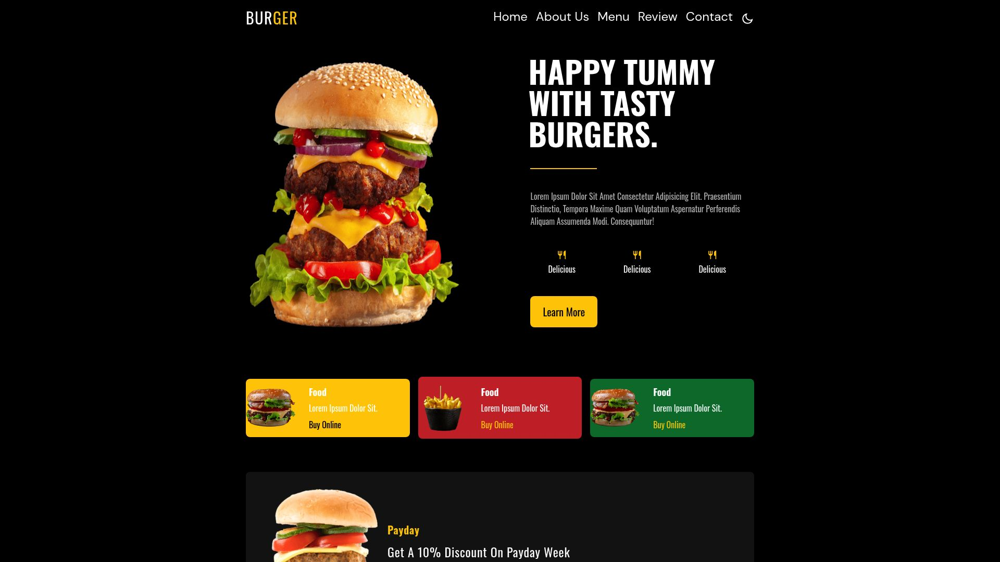

Burger Website
A responsive restaurant website showcasing a modern UI for a burger menu.
Technologies

HTML
CSS
Tailwind CSS
Font Awesome

Features

Responsive design optimized for mobile and desktop
Modern UI with Tailwind CSS
Font Awesome icons for enhanced visuals
Clean layout for menu and content sections

Installation

Clone the repository: git clone https://github.com/Islam-mohamed-74/Burger-Website
Open index.html in a browser

Live Demo 
View Live Demo https://islam-mohamed-74.github.io/project-burger/
